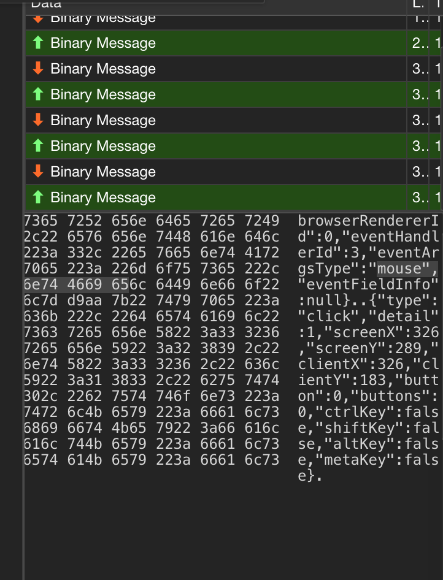

# *.NET Core Blazor* 1-Blazor项目文件分析

>本节内容为Blazor的基本文件

## 简介

Blazor是一个使用.NET技术用于代替JavaScript/typescript的前端WEB框架。在前端开发中使用.NET语言进行书写逻辑有利于我们的性能、可靠性和安全性。并且对于使用.NET开发人员而言，全栈的成本更低。

截止文章发布时，.NET Core已经发布了3.1版本，Blazor已经正式发布了Server-Side的框架，基于WebAssembly的Client-Side已经进入测试，预计2020年发布。Blazor实现了 *.NET Standard2.0* 。

Blazor你可以简单的理解为使用C#写Angular框架，Blazor是基于组件化开发的一款框架，Blazor的组件和页面通常使用Razor标记页的形式进行编码，因此我们也成为Razor组件(.razor)，借助Razor引擎，我们可以将html文件和C#语法进行切换。不过对于Blazor而言，它的设计思路和传统MVC是完全不同的，即使他们都使用Razor进行页面的开发，Blazor更倾向于客户端UI和逻辑的构成。

## Blazor的运行模式

我们知道，Blazor目前有两种运行方式，他们有着很本质的区别，如下文

### Server-Side

***Server-Side*** 也被称为Blazor服务器，它是完全运行于服务器上面，也就是说客户端的浏览器只是一个空壳页面，它不包含任何的逻辑和除了首页（通常会被称为‘_Host’）以外的任何页面，该种模式完全托管于服务器，UI的修改已经前端所发生的一切事件都需要传往服务器进行计算。传输的过程使用的是SignalR的方式。

使用这种方式意味着对于服务器的带宽以及性能要求会极其之高，但是对于一些需要使用到SignalR的应用以及一些访问量不大的地方使用SignalR也许会有不小的用途。
一次点击事件在websockets中的传输

并且在无操作的情况下，网页仍需要定期发送心跳包确认服务器状态，若服务器无响应，则整个网页停止服务


## ClientSide

Client-Side是SPA(Single Page Application)应用，基于一种叫WebAssembly的技术，WebAssembly(wasm)是一个开发的web标准，它是一种很底层的类似于字节码的东西，WebAssembly可以通过JavaScript访问浏览器的完整功能。在我们.NET运行在浏览器之前，Blazor会提前向浏览器发送一个可以运行在WebAssembly上的迷你版本的mono，我们知道.NET中的语言是可以运行在mono之上的，因此我们就等于变相的实现了在浏览器中运行.NET。并且所有代码都是在JavaScript沙盒中运行，也防御了许多不安全操作。

对于客户端模式，Blazor是将整个项目程序集和运行时(mono)一同发送到了浏览器，通过WebAssembly对JavaScript互操作处理DOM节点和相关api的调用。


## 两种方式对比

事实上两种方式都有其优缺点，ServerSide在访问量并不是那么大的时候，或者说你的服务器足够好的时候，可以很轻松的完成需要的任务，并且在网络聊天这种需要保持长期的网络连接的时候，ServerSide显然是首选，对于一些博客、或者一些普通的以页面展示为目的的网站，ClientSide显然要比ServerSide好一些，但是ClientSide有一个致命的缺点，也就是你的代码质量必须高，代码需要精简。因为你的程序集的大小会影响你的加载速度，因此我们应当尽可能缩小程序集。

## ServerSide项目文件解析

在微软提供的模板上面，大体上还是和我们的ASP.NET Core是接近的。在依赖注入中，因为我们利用了Razor来实现C#和html的混合编码以及我们使用的是ServerSide的Blazor，注入代码如下：

``` C#
    public void ConfigureServices(IServiceCollection services)
    {
        services.AddRazorPages();
        services.AddServerSideBlazor();
    }
```

中间件如下

``` C#
    app.UseEndpoints(endpoints =>
    {
        //匹配我们的signalR的连接
        endpoints.MapBlazorHub();
        //会自动的去pages/下寻找
        endpoints.MapFallbackToPage("/_Host");
    });
```

'_Host.cshtml'中

``` razor
    <app>
        <component type="typeof(App)" render-mode="ServerPrerendered" />
    </app>
```

这种方式会自动的去寻找App组件作为根组件，并且还有另一种方式

``` razor
    <app>
        @(await Html.RenderComponentAsync<App>(RenderMode.ServerPrerendered))
    </app>
```

这种方式可以无缝将你的MVC或者其他模式下的ASP.NET Core应用迁移到Blazor，这种方式是设置预渲染，使用Html.RenderComponentAsync<TComponent>() HTML帮助器预呈现应用程序内容。

而对于其他文件的布局是和我们经典的MVC模式一样的。

## ClientSide项目文件解析

对于ClientSide，就类似我们使用ASP.NET Core进行SPA应用开发的格式，对于Client的页面需要单独的一个项目去村，内部和普通的mvc或者serverside的写法类似，但是需要将中间件的服务修改以及我们的WebHost进行修改

``` C#
    // 替换为IBlazorApplicationBuilder
    public void Configure(IBlazorApplicationBuilder app)
    {
        //添加根组件
        app.AddComponent<App>("app");
    }
    // 更换webhost
    public static IWebAssemblyHostBuilder CreateHostBuilder(string[] args) =>
        BlazorWebAssemblyHost.CreateDefaultBuilder()                .UseBlazorStartup<Startup>();
```
随后你需要添加一个Server项目用于启动我们的服务，只需要在依赖注入中添加以下配置，中间件中激活我们的Blazor即可。

```C#
    services.AddResponseCompression(options =>
    {
        options.MimeTypes = ResponseCompressionDefaults.MimeTypes.Concat(new[]
        {
            MediaTypeNames.Application.Octet,
            WasmMediaTypeNames.Application.Wasm,
        });
    });
    // 中间件
    app.UseBlazor<Client.Startup>();

```

如果我的文章帮助了您，请您在github.NETCoreGuide项目帮我点一个star，在博客园中点一个关注和推荐。

>[Github](https://github.com/StevenEco/.NetCoreGuide)
>
>[BiliBili主页](https://space.bilibili.com/33311288)
>
>[WarrenRyan'sBlog](https://blog.tity.xyz)
>
>[博客园](https://cnblogs.com/warrenryan)
